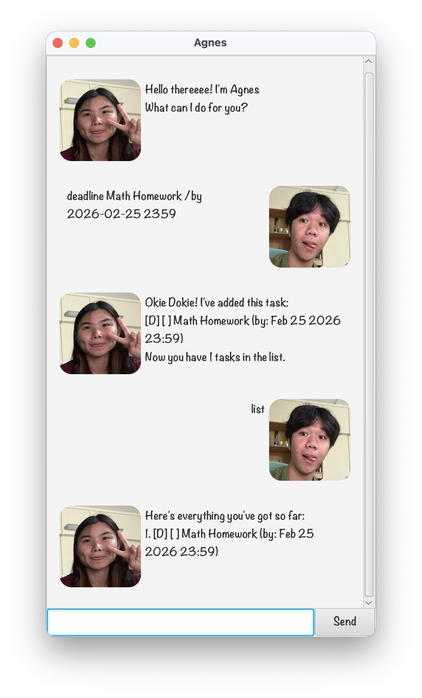

# Agnes - Your Lovely Task Assistant :DD 



Meet Agnes, your friendly task manager! Whether you're juggling deadlines, planning events, or just need to keep track of your endless to-dos, Agnes is here to help with a smile. 

---
## Getting Started

1. Download the latest `Agnes.jar` from the `/build/libs` folder. 
2. Double-click the JAR file to launch Agnes. 
3. Start typing commands and let Agnes take care of the rest!

---
## Features

### Adding To-Do Tasks

Add things you just need to do with no dates attached.

**Format:** `todo DESCRIPTION`

**Example:**
```
todo eat at PGP
```

**Agnes will reply:**
```
Okie Dokie! I've added this task:
  [T][ ] eat at PGP
Now you have 1 tasks in the list.
```

### Adding Deadline Tasks

Add things you must do by a certain date.

**Format:** `deadline DESCRIPTION /by DATE`

Date format: 
- `yyyy-MM-dd` (e.g., `2026-03-15`)
- `yyyy-MM-dd HHmm` (e.g., `2026-03-20 1400`)

**Example:**
```
deadline buy cake /by 2026-03-15
```

**Agnes will reply:**
```
Okie Dokie! I've added this task:
  [D][ ] buy cake (by: Mar 15 2026)
Now you have 2 tasks in your list.
```

### Adding Event Tasks

Add things with a start time and end time.

**Format:** `event DESCRIPTION /from DATETIME /to DATETIME`

Date format: 
- `yyyy-MM-dd` (e.g., `2026-03-15`)
- `yyyy-MM-dd HHmm` (e.g., `2026-03-20 1400`)

**Example:**
```
event birthday party /from 2026-03-20 1800 /to 2026-03-20 2200
```

**Agnes will reply:**
```
Okie Dokie! I've added this task:
  [E][ ] birthday party (from: Mar 20 2026 6:00 PM to: Mar 20 2026 10:00 PM)
Now you have 3 tasks in your list.
```

### View all tasks

Have a look at all your tasks in one place.

**Example:**
```
list
```

**Agnes will reply:**
```
Here's everything you've got so far:
1. [T][ ] eat at PGP
2. [D][ ] buy cake (by: Mar 15 2026)
3. [E][ ] birthday party (from: Mar 20 2026 6:00 PM to: Mar 20 2026 10:00 PM)
```

### Mark Tasks

When you've finished something, let Agnes know and she'll keep track!

**Format:** `mark TASK_NUMBER`

**Example:**
```
mark 1
```

**Agnes will reply:**
```
Nice! I've marked this task as done:
  [T][X] eat at PGP
```

### Unmark Tasks

If you change your mind, let Agnes know and she'll update her list!

**Format:** `unmark TASK_NUMBER`

**Example:**
```
unmark 1
```

**Agnes will reply:**
```
WTF... FINE..., I've marked this task as not done yet:
  [T][ ] eat at PGP
```

### Delete Tasks

If you want to get some tasks out of your list, Agnes
can help you with that!

**Format:** `delete TASK_NUMBER`

**Example:**
```
delete 2
```

**Agnes will reply:**
```
Siao EH. I've removed this task:
  [D][ ] buy cake (by: Mar 15 2026)
Now you have 2 tasks in your list.
```

### Find Tasks

Too many tasks to remember? Just find the task you need 
with a keyword!

**Format:** `find KEYWORD`

**Example:**
```
find party
```

**Agnes will reply:**
```
Here's what I found for "party":
1. [E][ ] birthday party (from: Mar 20 2026 6:00 PM to: Mar 20 2026 10:00 PM)
```

### Filter tasks by Date

Planning a birthday night or valentine's date? 
Find all your tasks on a specific date!

**Format:** `on DATE`

Date format:
- `yyyy-MM-dd` (e.g., `2026-03-15`)
- `yyyy-MM-dd HHmm` (e.g., `2026-03-20 1400`)

**Example:**
```
on 2026-03-20
```

**Agnes will reply:**
```
Here's what I found on 2026-03-20:
1. [E][ ] birthday party (from: Mar 20 2026 6:00 PM to: Mar 20 2026 10:00 PM)
```

### Update tasks

Did your task change? No worries, just update it with Agnes! 
She provides a hassle-free way to keep your task list up to date.

**Format:** `update TASK_NUMBER FIELD NEW_VALUE`

Supported fields:
- `/description` - update the description 
- `/by` - update the deadline's date 
- `/from` - update an event's start time 
- `/to` - update an event's end time

**Example:**
```
update 1 /description Agnes's birthday party
```

**Agnes will reply:**
```
Haode. Here's the updated task:
1. [E][ ] Agnes's birthday party (from: Mar 20 2026 6:00 PM to: Mar 20 2026 10:00 PM)
```

### BONUS: ~~Scold Agnes~~ Procastinate

Feeling a little angry? Just scold Agnes and she'll (hopefully not) scold you back!

**Example:**
```
kns
```

**Agnes will reply:**
```
KNS...
```

### Exiting Agnes

Got to go? Just say bye to Agnes!

**Example:**
```
bye
```

**Agnes will reply:**
```
Goodbye! Have a wonderful day ahead!
```

---
## Command Summary

| Command      | Format                                          | Example                                                  |
|--------------|-------------------------------------------------|----------------------------------------------------------|
| Add Todo     | `todo DESCRIPTION`                              | `todo read book`                                         |
| Add Deadline | `deadline DESCRIPTION /by DATE`                 | `deadline submit report /by 2026-02-20`                  |
| Add Event    | `event DESCRIPTION /from DATETIME /to DATETIME` | `event meeting /from 2026-02-20 1400 /to 2026-02-20 1600` |
| List Tasks   | `list`                                          | `list`                                                   |
| Mark Done    | `mark TASK_NUMBER`                              | `mark 1`                                                 |
| Unmark       | `unmark TASK_NUMBER`                            | `unmark 1`                                               |
| Delete       | `delete TASK_NUMBER`                            | `delete 1`                                               |
| Find         | `find KEYWORD`                                  | `find book`                                              |
| Filter       | `on DATE`                                       | `on 2026-03-20`                                          |
| Update       | `update TASK_NUMBER FIELD NEW_VALUE`            | `update 1 /description Agnes's birthday party`           |
| Exit         | `bye`                                           | `bye`                                                    |

---
## Tips and Tricks
- Use `yyyy-MM-dd` or `yyyy-MM-dd HHmm` for dates
- Task numbers start from `1`
- The `find` command is case-sensitive

